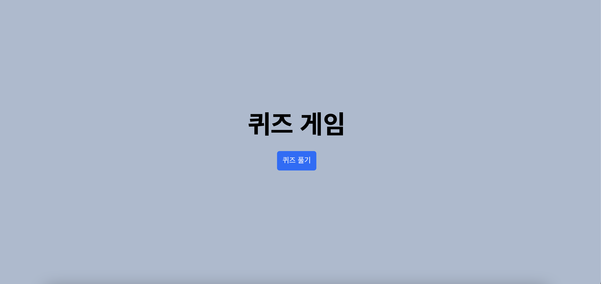
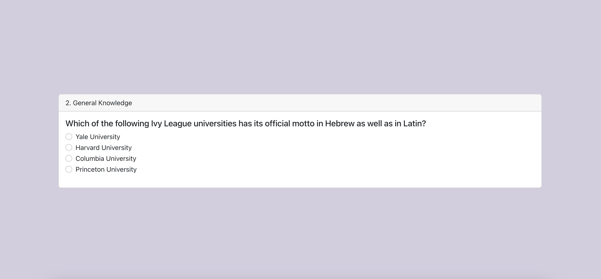
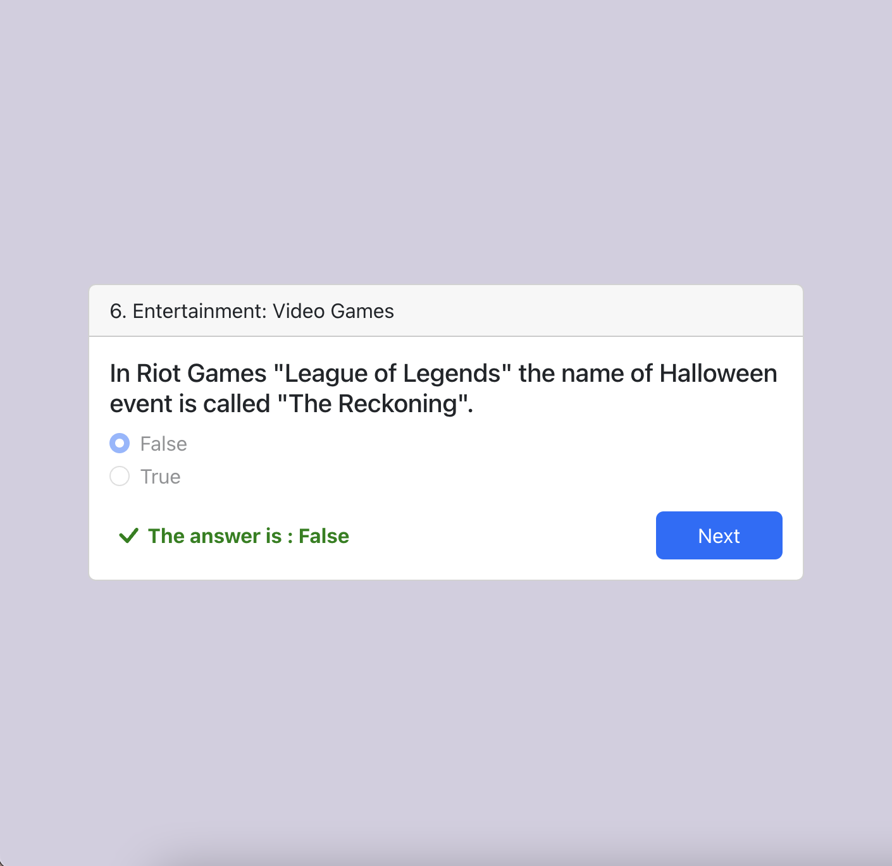
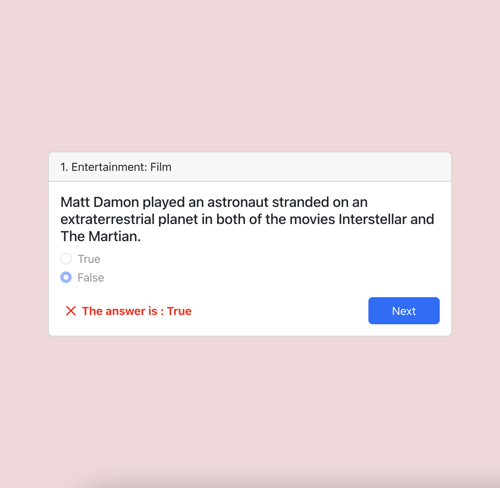
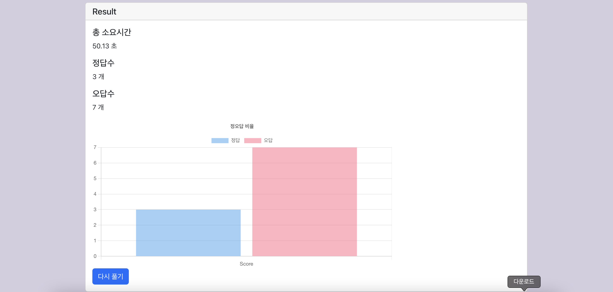

# 클래스팅 프론트엔드 포지션 과제

## [DEMO](https://choseunghei.github.io/classting-front-project/)
## 개발 환경

- react(18.2.0)  
- typescript(4.7.4)  
- **eslint**(8.20.0)  
- **prettier**(2.7.1)  

## 요구사항 반영

### 기본 요구 사항
[v] 사용자는 '퀴즈 풀기' 버튼을 클릭하여 퀴즈 풀기를 시작할 수 있다.  
[v] 사용자는 문항에 대한 답안을 4개 보기 중에 선택할 수 있다.  
[v] 사용자는 답안을 선택하면 다음 문항을 볼 수 있다.  
    [v] 답안 선택 후 다음 문항 버튼을 볼 수 있다.  
    [v] 답안이 맞았는지 틀렸는지 바로 알 수 있다.  
    [v] 다음 문항 버튼을 클릭하여 다음 문항으로 이동할 수 있다.  
[v] 모든 문항을 다 풀면 사용자는 다음과 같은 결과 정보를 볼 수 있다.  
    [v] 퀴즈를 마칠 때까지 소요된 시간  
    [v] 정답 개수  
    [v] 오답 수  

### 추가 요구 사항  
[v] 정 오답에 대한 비율을 차트로 표기  
[v] 다시풀기  
[ ] 오답노트  

### 테스트 코드 작성
* home.tsx 완료  

## 설계  

1. 요구사항 파악과 함께 화면 아우터라인 잡기  
   a. 게임시작 화면 (게임 시작 버튼, 게임 타이틀)  
   b. 게임진행 화면 (문제 제목, 문제 보기, 정오답 표기, 다음 버튼)  
   c. 게임결과 안내 화면 (정오답, 소요시간)

2. UI 라이브러리  
   a. React Bootstrap [link](https://react-bootstrap.github.io/)

3. 기타 라이브러리  
   a. axios  
    - ajax 통신을 위해 사용  
   b. chart.js [link](https://www.chartjs.org/)  
    - 정오답 비율을 보여주기 위해 사용
   c. react-loading [link](https://www.npmjs.com/package/react-loading)  
    - api http 통신 동안에 로딩시간 대기를 위해 사용

## 화면 설명

1. 첫 진입 화면(배경색 4개 루프)  
   

2. 로딩 화면
   

3. 퀴즈 화면
   

4. 퀴즈 정답 화면
   

5. 퀴즈 오답 화면
   

6. 퀴즈 결과 화면
   
